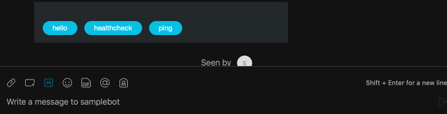

# How To


## Special Words

There are a few "special" keyword words you can use which have a special meaning in a Speedybot project:

- *<@submit>*: Handler that will run anytime data is submitted from an **[Adaptive Card](https://developer.webex.com/docs/api/guides/cards)**

- *<@catchall>*: Handler that will run on **every** message received from the backend

- *<@fileupload>*: Handler that will fire on **every** file-upload or file-attachment sent to the bot

- *<@help>*: There is a built-in help handler by default (it will print out all of your custom handler's helpTexts from settings/handlers.ts), but use this if you want to make your own

- *<@spawn>*: Gets called whenever a user adds your bot to a new space-- there are some caveats, however, to its behavior, so if you think you'll need this, see **[here](https://github.com/WebexSamples/webex-node-bot-framework/blob/master/README.md#spawn)**, **[here](https://developer.webex.com/blog/a-deeper-dive-into-the-webex-bot-framework-for-node-js)** or the **[resources page](https://github.com/valgaze/speedybot/blob/master/docs/resources.md)** for all the details

- *<@despawn>*: Opposite of spawn, see **[here](https://github.com/WebexSamples/webex-node-bot-framework/#despawn)** for details

ex.

```ts
export default handlers = [
	{
		keyword: ['hello', 'hey', 'yo', 'watsup', 'hola'],
		handler(bot, trigger) {
			const reply = `Heya how's it going ${trigger.person.displayName}?`
			bot.say(reply)
		},
		helpText: `A simple handler that greets the user`
	},
	{
		keyword: '<@catchall>',
		handler(bot, trigger) {
			// This could be used to send to a 3rd-party service like DialogFlow, Lex or GPT3 to extract intent &  parameters
			// ex. "I want a large strawberry ice cream" >> { intent: 'order_icecream', flavor: 'strawberry', size: 'large', originalQuery: 'I want a large strawberry ice cream"'}
			console.log('This gets triggered on EVERY message received')
		},
		helpText: `A handler triggered on every message`
	},
	{
		keyword: '<@submit>',
		handler(bot, trigger) {
			bot.say(`Submission received! You sent us ${JSON.stringify(trigger.attachmentAction.inputs)}`)

			// ex. From here, data could be passed to a 3rd-party integration

		},
		helpText: `A special handler that fires anytime a user submits data (you can only trigger this handler by tapping Submit in a card)`
	},
	{
		keyword: '<@fileupload>',
		handler(bot, trigger) {
			const files = trigger.message.files || []

			bot.say(`(**Note:** These files are not publicly accessible)\n ${files.length > 1 ? 'These files were' : 'This file was'} uploaded successfully!`)

			files.forEach(async (file, idx) => {
				// Note the URL here will fail for user because they require an Authorization 

				await bot.say(`${idx + 1}: ${file}`)
			})

			if (files.length === 1) {
				bot.dm(trigger.person.id, `Sending a file back at ya!`)
				bot.dm(trigger.person.id, { file: 'https://camo.githubusercontent.com/b846bfa57dd26af4e1526abe1173e0b332b75af5d642564b2ab1d0c12a482290/68747470733a2f2f692e696d6775722e636f6d2f56516f5866486e2e676966' })
			}
			// ex. From here, you could download the content of the files (with an Authorization header)
			// Pass onto another service for analysis/etc
		},
		helpText: `A special handler that fires anytime a user submits a file`
	}
]
```

## Get a Bot Access Token

- (Recommended) Create new bot: https://developer.webex.com/my-apps/new/bot

- Get an existing bot's token (tap "regenerate"): https://developer.webex.com/my-apps


## Connect to your bot

- Start a 1-1 & ask your bot "healthcheck"-- if all works well you should see something like this:


You can also add a bot to a group space, but note that you or any other human members of the space will need to explicitly "@"-mention the bot to get functionality

## Suggestion Chips

A suggestion "chip" is a button which, when clicked, is the equivalent of the user entering the same text. 

ex. 




Ex. If a button/chip has the label "bongo", when the user taps it, the phrase "bongo" will be processed by chat handlers as if the user typed "bongo" on their own

We can approximate this effect with two handlers-- one to show the card with the "chip" buttons and the other to "catch" the button tap. 
```ts
export const handlers = [{
	keyword: '<@submit>',
	handler(bot, trigger) {
		// Check for "chip_action" value to make sure it's a chip tap
		if (trigger.attachmentAction.inputs.chip_action) {
			bot.say(`You picked '${trigger.attachmentAction.inputs.chip_action}'`)

			const payload = {
				roomId: trigger.attachmentAction.roomId,
				personId: trigger.person.id,
				text: trigger.attachmentAction.chip_action,
			}
			// HACK: pass the button-tap value through the handler system
			bot.framework.onMessageCreated(payload)
		}
	},
	helpText: 'A special handler for handling user input'
}, {
	keyword: 'sendchip',
	handler(bot, trigger) {
		// Make a card with 3 chips: 'hello', 'healthcheck', and 'ping'
		const cardPayload = {
			"type": "AdaptiveCard",
			"body": [],
			"actions": [{
				"type": "Action.Submit",
				"title": "hello",
				"data": {
					"chip_action": "hello"
				}
			}, {
				"type": "Action.Submit",
				"title": "healthcheck",
				"data": {
					"chip_action": "healthcheck"
				}
			}, {
				"type": "Action.Submit",
				"title": "ping",
				"data": {
					"chip_action": "ping"
				}
			}],
			"$schema": "http://adaptivecards.io/schemas/adaptive-card.json",
			"version": "1.2"
		}
		bot.sendCard(cardPayload, 'Your client doesnt appear to support adaptive cards')

	},
	helpText: 'A special handler for handling user input'
}]
```