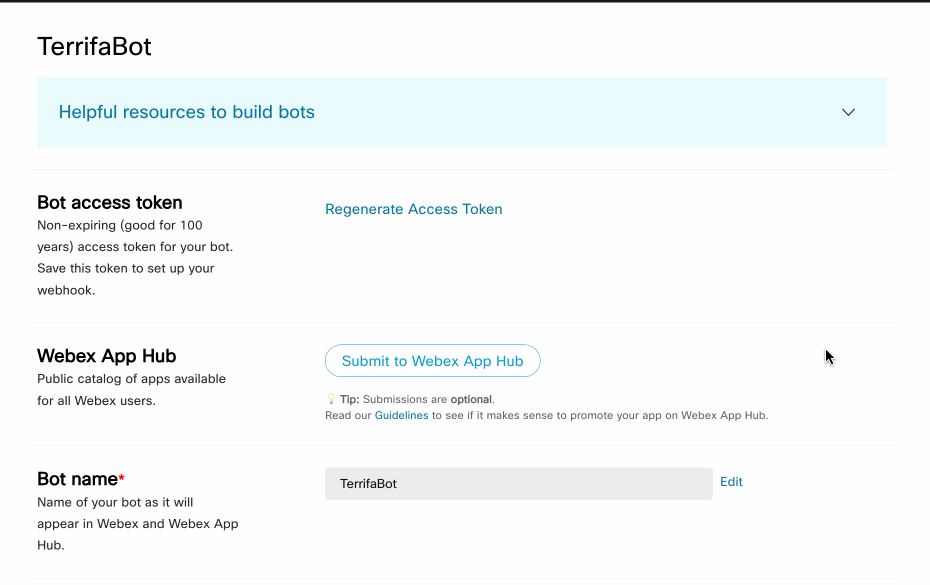
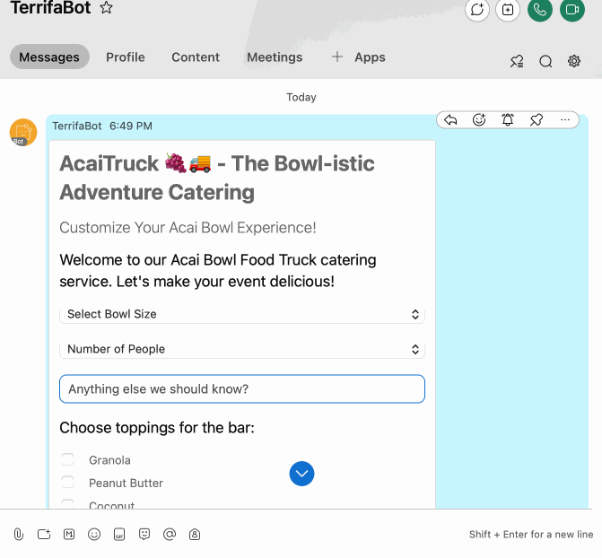

# "I'm new here" 🐣

tl;dr: SpeedyBot helps you efficiently design, deploy, and secure rich conversation systems-- especially in enterprises and large teams with complex requirements

Follow the quick setup below to go from zero to a SpeedyBot running on your local machine (which you can later seamlessly **[deploy to any infrastructure you want](./examples.md)** if needed)

## Step I: Grab Your Access Token

- You'll need a WebEx account to build bots— if you don't have one one, sign up for a new account here: **[https://signup.webex.com/sign-up](https://signup.webex.com/sign-up)**

- Once you have an account, create a new bot and copy its access token from here: **[https://developer.webex.com/my-apps/new/bot](https://developer.webex.com/my-apps/new/bot)**

The flow to get a token will look roughly like this:


### Validate Token

Once you've got your token, pop it into the box below to validate it & review your bot's details

<TokenInput :showInfo="true" :autofocus="false"/>

::: details Is this safe??

Your bot token is a **highly** sensitive credential and should be protected with encryption and proper secrets management.

SpeedyBot does **NOT** log/persist or do anything (except what you tell it to do) with your bot token.

**REMEMBER:** If your agent's access token is ever compromised/exposed, you can always invalidate it + get a new one by tapping "Regenerate Access Token" under your agent's <a href="https://developer.webex.com/my-apps" style="color:#646cff;text-decoration: bold;">settings page</a>



:::

## Step II: Send a Test Message with Your Access Token

- Let's test out your bot access token by sending a **[SpeedyCard](./speedycard.md)** to you as a direct message (tap the 🎲 to shuffle through some examples as inspiration or write your own)

  <SpeedyCardEditor></SpeedyCardEditor>

- When you're ready, tap the **Send Message** tab and use the email you signed up with as the destination and hit Send-- in about a second you should receive a new message from your bot

## Step III: Setup your SpeedyBot Listener

<el-alert
    title="⛔️ Nobody is listening"
    type="error"
    description="You may have noticed that if you tried to submit any data back from a card-- nothing happens "
  />



- In fact, any user interaction with {{ store.state.userData?.emails[0] ?? 'your bot'}} right now— be it a message, SpeedyCard submission, or file upload, results in icy radio silence

- That's because there's nobody "home" to answer the request-- SpeedyBot can "listen" for messages (or card data submissions or files) so anytime someone interacts with your bot it will respond back automatically per your instructions

## Run your bot from your computer

- Keeping things simple to start you'll run the bot from your machine (ie when your computer is off, your bot is "off") but later if you need to, you can deploy it to virtually **[any standard server or scalable serverless cloud infrastructure you want](./examples/index)**

Copy the commands below to get up and running

::: code-group

```sh-vue [🥺 New (recommended)]
npx speedybot setup {{ store.state.tokenValid ? `--token ${store.state.token} ` : '' }}--project default
```

```sh-vue [👹 Experienced]
git clone https://github.com/valgaze/speedybot
cd speedybot
cd examples/speedybot-starter
npm i
npm run bot:setup {{ store.state.tokenValid ? store.state.token : '__ACCESS__TOKEN__HERE__' }}
```

:::

::: details Getting errors?

If you see an error like `npm: command not found` you probably need to install node or a compatible runtime onto your system.

There are many ways to do this, but two easy ways:

**Option 1** Download + install Node from the official site: **[https://nodejs.org/en/download](https://nodejs.org/en/download)**

or

**Option 2** Download with **[Volta](https://docs.volta.sh/guide/)** in the terminal

```sh
curl https://get.volta.sh | bash

volta install node
```

However you set up your system, make sure to run `node -v` in your terminal to verify node is correctly installed and you can get up and running with `npx speedybot setup --project default`:


:::

Now send a message to your bot and you'll see a welcome screen with buttons and cards:


You can now customize this bot however you want by editing the file **[settings/bot.ts](https://github.com/valgaze/speedybot/blob/v2/examples/speedybot-starter/settings/bot.ts)**


You can turn off your bot by holding down **CTRL-C** on your keyboard or exiting the terminal

Whether you're just starting out on your conversation design journey or a seasoned pro, SpeedyBot has you covered for crafting bots that can do it all-- securely integrate w/ LLMs + content management systems, **[process file-uploads](./patterns.md#handle-file-uploads)**, **[segment content based on user data + behavior](./patterns.md#restrict-access-pattern)**, create + manage **[SpeedyCards](./speedycard.md)**, ask for a user's location in a privacy-respecting way, and much more.

When you're ready to deploy it to a server, serverless function or virtually any infrastructure/device, **[check out the examples](./examples.md)**

<script setup>
import { ref, watch } from 'vue'
import { useData } from 'vitepress'
import { useCustomStore } from "./.vitepress/util/store";
import TokenInput from './.vitepress/components/token_handler.vue'
import Blur from './.vitepress/components/Blur.vue'
import SpeedyCardEditor from './.vitepress/components/SpeedyCardEditor.vue'
const { isDark } = useData()
const store = useCustomStore()

const currentStep = ref(0)
const type = ref(1)

</script>
