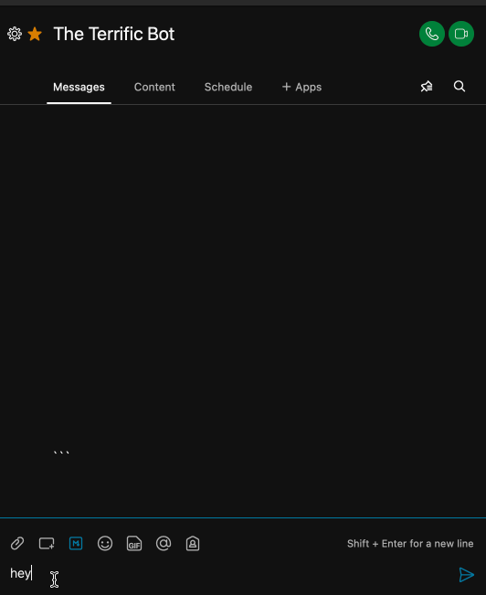
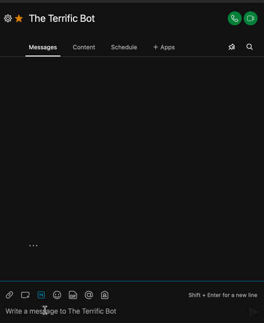

Speedybot $uperpowers: various helper utilities to give your bot $uperpowers when interacting with 3rd-party integrations, files, external resources, and adds the capability get/set/delete conversational "contexts." To give your bot instance $uperpowers, just wrap it in an ```$```


##### Samples
- **[Kitchen sink](#kitchen-sink)**
- **[Extract uploaded file](#get-uploaded-file-details)**
- **[Extract uploaded file (ex spreadsheets)](#retrieve-raw-file-data)**


## Kitchen sink

 (not including file handling)

```ts
import { $ } from 'speedybot'

export default 	[{
    keyword: ['$', '$uperpowers', '$uperpower', '$superpower'],
    async handler(bot, trigger) {

        // ## 0) Wrap the bot object in $ to give it $uperpowers, ex $(bot)
        const $bot = $(bot)

        // Provide some space
        $bot.clearScreen()

        // ## 1) Contexts: set, remove, and list
        // Contexts persist between "turns" of chat
        // Note: contexts can optionally store data
        // If you just need to stash information attached to a user, see "$(bot).saveData" below
        await $bot.saveContext('mycontext1')
        await $bot.saveContext('mycontext2', { data: new Date().toISOString()})

        const mycontext2 = await $bot.getContext('mycontext2')
        $bot.log('# mycontext2', mycontext2) // { data: '2021-11-05T05:03:58.755Z'}

        // Contexts: list active contexts
        const allContexts = await $bot.getAllContexts() // ['mycontext1', 'mycontext2']
        bot.say(`Contexts: ${JSON.stringify(allContexts)}`)

        // Contexts: check if context is active
        const isActive = await $bot.contextActive('mycontext1')
        $bot.log(`mycontext1 is active, ${isActive}`) // 'mycontext1 is active, true'

        // Contexts: remove context
        await $bot.deleteContext('mycontext1')

        const isStillActive = await $bot.contextActive('mycontext1')
        $bot.log(`mycontext1 is active, ${isStillActive}`) // 'mycontext1 is active, false'

        // ## 2) Helpers to add variation and rich content

        // sendRandom: Sends a random string from a list
        $bot.sendRandom(['Hey!','Hello!!','Hiya!'])

        // sendTemplate: like sendRandom but replace $[variable_name] with a value
        const utterances = ['Hey how are you $[name]?', `$[name]! How's it going?`, '$[name]']
        const template = { name: 'Joey'}
        $bot.sendTemplate(utterances, template)

        // sendURL: Sends a URL in a clickable card
        $bot.sendURL('https://www.youtube.com/watch?v=3GwjfUFyY6M', 'Go Celebrate')

        // snippet: Generate a snippet that will render data in markdown-friendly format
        const JSONData = {a: 1, b:2, c:3, d:4}

        $bot.sendSnippet(JSONData, `**Here's some JSON, you'll love it**`) // send to room

        // Snippet to a specifc room or specific email
        // const snippet = $bot.snippet(JSONData)
        // $bot.send({markdown: snippet, roomId:trigger.message.roomId, text: 'Your client does not render markdown :('}) // send to a specific room
        // $bot.send({markdown: snippet, toPersonEmail:'joe@joe.com', text: 'Your client does not render markdown :('}) // send to a specific person

        // ## 3) Conversation "chips"

        // Set all chips to disappear after tap (defaults to false)
        $bot.setChipsConfig({disappearOnTap: true})

        // Send chip with custom handler
        const customChip = { 
            label: 'custom chip', 
            handler(bot:BotInst, trigger: Trigger) {
                $bot.sendSnippet(trigger, `**The 'custom chip' was tapped**	`)
                $bot.$trigger('chips', trigger) // re-render chips
            }
        }

        // Add optional title to chips
        $bot.sendChips(['hey', 'ping', 'pong', '$', {label:`Trigger the 'hey' handler`, keyword: 'hey'}, customChip], 'These chips will disappear on tap')


        // ## 4) Save data between conversation "runs" (scoped to user, async)

        interface SpecialUserData {
            specialValue: string;
            userId: String;
        }
        const specialData:SpecialUserData = {
            specialValue: Math.random().toString(36).slice(2),
            userId: trigger.personId,
        }
        
        // Save the data
        await $bot.saveData<SpecialUserData>('userData', specialData)
        
        // Retrieve the data (returns null if does not exist)
        const dataRes = await $bot.getData<SpecialUserData>('userData')

        if (dataRes) {
            // These are now "typed"
            const theValue = dataRes.specialValue
            const id = dataRes.userId
            $bot.log(`Your specal value was ${theValue} and your id is ${id}`)

            // destroy data
            $bot.deleteData('userData')
        }

        // ## 4a) Stash "global" values between runs (don't use a lot, short snippets like counters or other data)
        // Note: not persistent storage if using default storage provider
        const globalVal = $bot.globalGet('myKey')

        if (!globalVal) {
            $bot.globalSave('myKey', { dateAdded: new Date().toISOString() })
        }


        // ## 5) Integrate with 3rd-parties: $bot.get, $bot.post, etc

        // ex. get external data
        // Opts are axios request config (for bearer tokens, proxies, unique config, etc)
        const res = await $bot.get('https://randomuser.me/api/')
        bot.say({markdown: $bot.snippet(res.data)})

        // ## 6) Files & attachments

        // Send a local file
        // Provide a path/filename, will be attached to message
        $bot.sendFile(__dirname, 'assets', 'speedybot.pdf')

        // Send a publically accessible URL file
        // Supported filetypes: ['doc', 'docx' , 'xls', 'xlsx', 'ppt', 'pptx', 'pdf', 'jpg', 'jpeg', 'bmp', 'gif', 'png']
        $bot.sendDataFromUrl('https://drive.google.com/uc?export=download&id=1VI4I4pYVVdMnB6YOQuSejVcrSwN0cotd')

        // // experimental (fileystem write): send arbitrary JSON back as a file
        // $bot.sendDataAsFile(JSON.stringify({a:1,b:2}), '.json')

        // For an example involving parse'able spreadsheets (.xlsx), see here: https://github.com/valgaze/speedybot-superpowers
    },
    helpText: 'A demo of $uperpowers'
}]
```

## Get uploaded file details

Important note: If you attempt to display a snippet of an uploaded file (like a user-submitted list), note that message length is limited to 7439 characters before encryptions & 10000 after encryption

```ts
import { $ } from 'speedybot'

export default {
    keyword: '<@fileupload>',
    async handler(bot, trigger) {
            const supportedFiles = ['json', 'txt', 'csv']
            // take 1st file uploaded, note this is just a URL
            const [file] = trigger.message.files

            // Retrieve file data
			const fileData = await $(bot).getFile(file)
			const { extension, type, } = fileData

            if (supportedFiles.includes(extension)) {
                const {data} = fileData
                // bot.snippet will format json or text data into markdown format
                bot.say({markdown: $(bot).snippet(data))})
            } else {
                bot.say(`Sorry, somebody needs to add support to handle *.${extension} (${type}) files`)
            }
    }, 
    helpText: `Special handler that's fired when the user uploads a file to your bot (by default supports json/csv/txt)`
}
```

## Retrieve raw file data

(ex spreadsheets)

```ts
import { $ } from 'speedybot'

export default {
    keyword: '<@fileupload>',
    async handler(bot, trigger) {
            const supportedFiles = ['xlsx']

            // take 1st file uploaded, note this is just a URL
            const [file] = trigger.message.files

            // Retrieve file data (note response type)
			const fileData = await $(bot).getFile(file, {responseType: 'arraybuffer'})
			const { extension, type, } = fileData

            if (supportedFiles.includes(extension)) {
                const {data} = fileData
                // Transform data with a library like SheetJS: https://www.npmjs.com/package/xlsx

                // See <@fileupload> handler here: https://github.com/valgaze/speedybot-superpowers

            } else {
                bot.say(`Sorry, somebody needs to add support to handle *.${extension} files`)
            }
    }, 
    helpText: `Special handler that's fired when the user uploads a file to your bot (by default supports json/csv/txt)`
}
```

## Chips Disappear







## Chips Persist