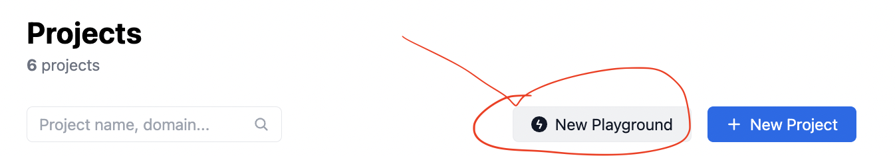
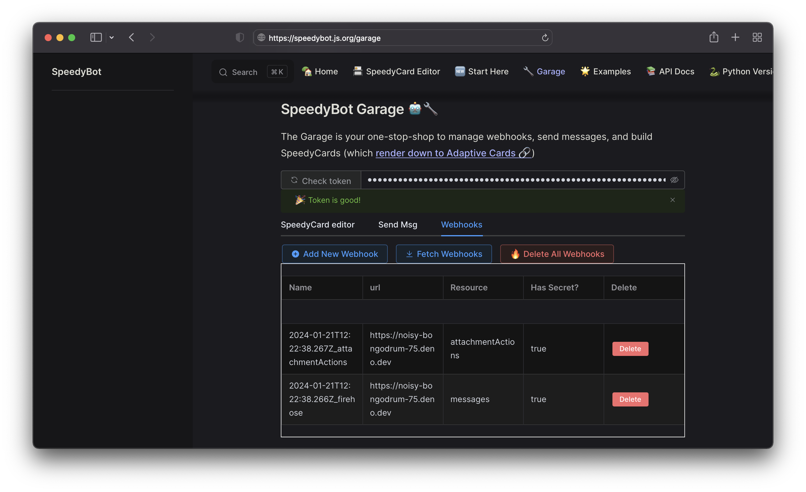

# [QUICKSTART] 🦖 Deploy your bot to Deno

Note: The steps below assume you have a **[working WebEx account](https://developer.webex.com/signup)** & a **[Deno Deploy account](https://deno.com/deploy/)**

## 1) Get your bot access token

- If you have an existing bot, get its token here: **[https://developer.webex.com/my-apps](https://developer.webex.com/my-apps)**

- If you don't have a bot, create one and save the token from here: **[https://developer.webex.com/my-apps/new/bot](https://developer.webex.com/my-apps/new/bot)**

- Write down your bot's access token, you'll need it in a minute

## 2) Create a new Project in Deno

- If you don't have one, sign up for a **[deno deploy account](https://deno.com/deploy)**

- Press the blue "New Playground" button

Note: There are many (better) ways to setup Deno, but for now we can just use the Playground and copy/paste everything in **[index.ts](./index.ts)**

## 3) Expose your bot access token to Deno

- You could insert your bot token directly in the Playground but a safer way is to use Deno environmental variables

- Inside your playground, tap the Settings button and add your `token` secret (the Bot token from step 1)

- If you're using a webhook secret (which you should), add it as a secret `webhookSecret`

Verify you hit save underneath each secret you add to the playground

## 4) Register your webhook

- Grab your playground's URL (it'll be a strange name like https://noisy-bongodrum-75.deno.dev) and register your webhook using SpeedyBot Garage

- Visit https://speedybot.js.org/garage and select **webhooks** and add your URL and optional (though highly recommeneded) webhook secret

- If all went well you should see this and your bot is up and running on Deno!

